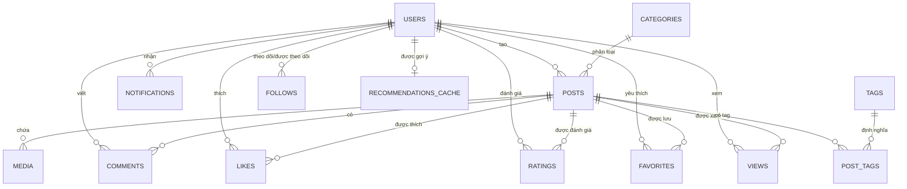

# Hướng dẫn Cơ sở Dữ liệu (Database Guide): FoodRec AI

FoodRec AI sử dụng MySQL để quản lý dữ liệu. Hệ thống được thiết kế theo dạng chuẩn hóa để đảm bảo tính nhất quán và hiệu năng cho thuật toán gợi ý.

## 📊 Sơ đồ Quan hệ thực thể (ERD)

## 📝 Chi tiết các Bảng chính

### 1. `users`
Lưu trữ thông tin tài khoản người dùng và vai trò (Admin/User).
- `username`: Định danh duy nhất.
- `role`: Phân quyền người dùng (`admin` có thể quản lý bài viết).

### 2. `posts`
Lưu trữ thông tin về các món ăn/địa điểm ẩm thực.
- `title`, `description`: Tiêu đề và mô tả.
- `price`: Giá tham khảo.
- `location`: Địa chỉ.
- `category_id`: Liên kết đến bảng danh mục.

### 3. `categories` & `tags`
Dùng để phân loại nội dung, là cơ sở cho thuật toán **Content-based Filtering**.
- `categories`: Các nhóm lớn (VD: Món mặn, Tráng miệng).
- `tags`: Các đặc tính cụ thể (VD: Cay, Tốt cho sức khỏe, Vegan).

### 4. Tương tác Người dùng (Interactions)
Các bảng này là đầu vào của thuật toán **Collaborative Filtering**:
- `likes`: Tín hiệu yêu thích (Sơ cấp).
- `favorites`: Tín hiệu quan tâm cao.
- `ratings`: Đánh giá 1-5 sao (Tín hiệu tường minh nhất).
- `views`: Lịch sử xem bài viết (Tín hiệu ngầm định).

### 5. `recommendations_cache`
Lưu trữ danh sách các `post_id` được gợi ý cho mỗi `user_id`.
- Tối ưu hóa hiệu năng: Thay vì tính toán AI mỗi lần người dùng tải trang, hệ thống sẽ đọc từ Cache và chỉ cập nhật lại khi cần thiết.

## 🚀 Tối ưu hóa Indexing

Hệ thống sử dụng các Index sau để tăng tốc độ truy vấn:
- `idx_follows_follower` & `idx_follows_following`: Tăng tốc tính năng Social.
- `idx_posts_user`: Tăng tốc khi xem danh sách bài viết của một user.
- `idx_notifications_user`: Tăng tốc khi tải thông báo.

---
> [!TIP]
> Sử dụng script `database/seeder.js` để tự động tạo dữ liệu mẫu phong phú phục vụ cho việc kiểm thử thuật toán gợi ý.
