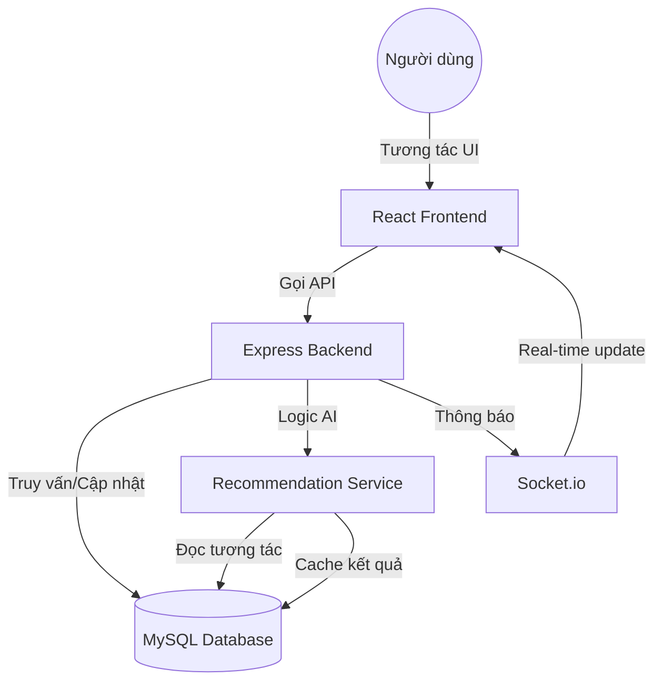

# Kiến trúc Hệ thống: FoodRec AI

FoodRec AI là một ứng dụng full-stack hiện đại, được thiết kế để cung cấp các gợi ý ẩm thực cá nhân hóa dựa trên dữ liệu người dùng.

## 🏗️ Tổng quan Công nghệ (Tech Stack)

Hệ thống được xây dựng trên mô hình Client-Server truyền thống với sự hỗ trợ của giao tiếp thời gian thực.

| Tầng (Layer) | Công nghệ sử dụng | Vai trò |
| :--- | :--- | :--- |
| **Frontend** | React 18, Vite, Tailwind CSS, Zustand | Giao diện người dùng, quản lý trạng thái và hoạt ảnh. |
| **Backend** | Node.js, Express, Socket.io | Xử lý logic nghiệp vụ, API, và thông báo thời gian thực. |
| **Database** | MySQL | Lưu trữ dữ liệu quan hệ (Users, Posts, Interactions). |
| **Authentication** | JSON Web Token (JWT) | Bảo mật và xác thực người dùng. |

## 🔄 Luồng Dữ liệu (Data Flow)

Dưới đây là sơ đồ mô tả cách dữ liệu di chuyển trong hệ thống:

## 📱 Frontend (Giao diện người dùng)

- **Vite & React**: Cung cấp hiệu năng phát triển nhanh và trải nghiệm mượt mà.
- **Tailwind CSS**: Thiết kế hiện đại (Glassmorphism), tối ưu hóa cho di động.
- **Zustand**: Quản lý trạng thái toàn cục (Auth state, UI state) nhẹ nhàng hơn Redux.
- **Framer Motion**: Tạo các hiệu ứng chuyển cảnh và tương tác tinh tế.

## ⚙️ Backend (Máy chủ xử lý)

- **Express.js**: Framework tối giản nhưng mạnh mẽ để xây dựng RESTful API.
- **JWT Middleware**: Bảo vệ các route nhạy cảm (Interactions, Profile, Admin).
- **Recommendation Service**: Trái tim của hệ thống, thực hiện các thuật toán khai phá dữ liệu (Collaborative & Content-based Filtering).
- **Socket.io**: Xử lý logic thông báo (Notifications) ngay lập tức khi có bài viết mới hoặc admin thông báo.

## 🗄️ Database (Cơ sở dữ liệu)

- Sử dụng MySQL để lưu trữ dữ liệu có cấu trúc.
- Các bảng được thiết kế để tối ưu hóa việc truy vấn "Ma trận tương tác" (User-Item Matrix) phục vụ AI.
- Hệ thống Indexing được thiết lập trên các cột quan trọng như `user_id`, `post_id` để tăng tốc độ xử lý.

---
> [!NOTE]
> Hệ thống được thiết kế theo dạng Module hóa, dễ dàng mở rộng thêm các thuật toán AI mới mà không làm ảnh hưởng đến luồng giao diện.
